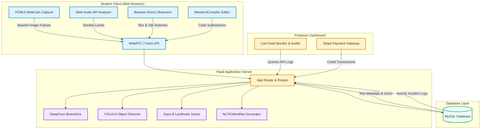

# AI-Proctor: Secure AI-Powered Online Examination & Intelligent Proctoring System 🎓🤖

[](https://www.python.org/)
[](https://flask.palletsprojects.com/)
[](https://www.tensorflow.org/)
[](https://opencv.org/)
[](https://www.docker.com/)
[](https://www.mysql.com/)
[](https://stripe.com/)
[](LICENSE)

**AI-Proctor** is a robust, end-to-end, high-integrity online examination platform built with Python, Flask, and JavaScript. The system is designed to conduct objective, subjective, and practical coding tests while ensuring strict academic integrity through a multi-dimensional AI-based proctoring pipeline. It features automated identity verification, visual tracking (gaze estimation, head posture, phone detection), browser-level isolation, real-time noise detection, and dynamic NLP-powered test generation.

---

## 🚀 Key Capabilities & Features

### 1. Multi-Dimensional AI Proctoring Engine 👁️
The platform employs state-of-the-art computer vision and deep learning techniques to monitor candidates continuously:
*   **Biometric Identity Verification:** Integrates **DeepFace** (VGG-Face weights) to perform facial recognition check-in, matching the student's face against their registered profile photo before granting access to the test.
*   **Head Pose Estimation:** Uses 68 face landmark points and `cv2.solvePnP` to estimate head pitch, yaw, and roll. It automatically flags anomalies (e.g., *Head Up*, *Head Down*, *Looking Left*, or *Looking Right*).
*   **Gaze & Eye Tracking:** Analyzes iris movements to detect when a student is looking away from the screen, tracking left/right/center positions and calculating blinking rates.
*   **Object Detection (YOLOv3):** Employs YOLOv3 weights to scan the webcam feed for unauthorized objects, specifically flagging **mobile phones** and tracking the count of people in the frame (flagging *No Person* or *Multiple People*).
*   **Microphone Audio Monitoring:** Utilizes the Web Audio API on the client side (`AudioContext` and `ScriptProcessorNode`) to measure real-time ambient noise levels (decibels) and transmit volume statistics to detect verbal collaboration.

### 2. Browser & Window Isolation Security 🛡️
*   **Tab Switch & Blur Tracking:** Automatically catches window focus/blur browser events and immediately notifies the system, logging tab changes and displaying immediate warnings to the student.
*   **Lockdown Controls:** Optional integration triggers to minimize academic dishonesty during testing windows.

### 3. Comprehensive Testing Modules 📝
*   **Objective Exams (MCQ):** Standard multiple-choice tests with optional negative marking and embedded widgets (like an on-screen calculator).
*   **Subjective Exams:** Written test fields allowing students to answer conceptual questions.
*   **Practical (Coding) Exams:** Features a built-in interactive compiler environment. Supports compilation and execution for **15+ programming languages** (C, C++, Java, Python, Node.js, etc.) via customized widget SDKs.

### 4. Intelligent NLP Test Generator (Auto-Authoring) 🧠
*   **Automatic MCQ Generator:** Automatically generates fill-in-the-blank or multiple-choice questions from textbooks or text materials using NLTK Part-of-Speech (POS) tagging and phrase chunking. It parses hypernyms and hyponyms from **WordNet** to dynamically generate distractors (wrong options).
*   **Automatic Subjective Generator:** Scans uploaded course files, selects key academic concepts, and synthesizes questions (such as *"Explain in detail X"*, *"Define Y"*) along with matching reference answers.

### 5. Instructor & Monetization Dashboards 📊
*   **Live Proctoring Console:** Instructors can view student metadata and real-time proctoring status logs (visual warnings, head movements, ambient decibel flags, phone detection status) chronologically.
*   **Stripe Integration:** Built-in monetization where professors can purchase secure exam hosting credits via Stripe Payment Intent APIs.

---

## 🛠️ Architecture & Workflow



---

## 📋 Technical Prerequisites

Before deploying the project, ensure your environment meets the following specifications:
*   **Python:** Version `3.8` (Recommended due to legacy Tensorflow 2.2.0 & DeepFace dependencies).
*   **C++ Build Tools:** Needed to compile the C++ bindings for the `dlib` landmark estimator library.
    *   *Windows:* Visual Studio Build Tools with "Desktop development with C++" workload installed.
    *   *Linux:* `build-essential` and `cmake`.
*   **MySQL Server:** Local or cloud instance (MySQL 5.7+ / 8.0).
*   **SMTP Mail Server:** Email credentials (e.g., Gmail App Passwords) for sending secure registration OTPs.
*   **Stripe API Keys:** Valid Publishable & Secret credentials for Stripe payment integration.

---

## 🚀 Installation & Setup

### Option 1: Docker Compose Deployment (Recommended)
Docker containerization handles all Python dependencies, dlib C++ compilation, and MySQL server setup automatically.

1.  **Clone the Repository:**
    ```bash
    git clone https://github.com/YourUsername/AI-Proctor.git
    cd AI-Proctor/AI-Proctor-master
    ```

2.  **Configure Environment Variables:**
    Open `docker-compose.yml` and verify the environmental variables:
    ```yaml
    MAIL_USERNAME: "your_email@gmail.com"
    MAIL_PASSWORD: "your_app_password"
    # Ensure MySQL settings match your intended setup
    ```

3.  **Spin up Containers:**
    ```bash
    docker-compose up --build
    ```
    This builds the Flask app, downloads VGG-Face DeepFace weights, initializes the MySQL instance, and imports the database schema. Access the application on `http://localhost:5001`.

---

### Option 2: Local Manual Setup

1.  **System Prerequisite Setup (Windows Developers):**
    Install `CMake` and ensure it is added to your system `PATH`. Install Visual Studio C++ Compiler tools.

2.  **Virtual Environment & Python Package Setup:**
    ```bash
    # Create and activate environment
    python -m venv .venv
    
    # On Windows:
    .venv\Scripts\activate
    # On Unix/macOS:
    source .venv/bin/activate
    
    # Upgrade build core tools
    pip install --upgrade pip setuptools wheel
    
    # Install dependencies
    pip install -r requirements.txt
    ```

3.  **Install dlib & TensorFlow Dependencies:**
    ```bash
    pip install cmake dlib
    pip install "protobuf<=3.20.1" Flask-Session==0.3.2
    ```

4.  **Download AI Models & Weights:**
    Make sure you have a `models` directory inside the project root and download the necessary weights:
    *   **OpenCV Face Detector:** `deploy.prototxt` & `res10_300x300_ssd_iter_140000.caffemodel`
    *   **YOLOv3 Weights:** `yolov3.weights` (Download from the official darknet project)
    *   **Pose Landmarks Model:** `pose_model` folder (containing Tensorflow Keras model files)

5.  **Database Migration:**
    Log in to your local MySQL console and run:
    ```sql
    CREATE DATABASE quizapp;
    USE quizapp;
    SOURCE DB/quizappstructure.sql;
    ```

6.  **Run Development Server:**
    ```bash
    python app.py
    ```
    Open `http://localhost:5000` in your web browser.

---

## 📂 Project Structure

```
AI-Proctor-master/
├── DB/                      # Database Schemas and SQL dumps
│   └── quizappstructure.sql # Main MySQL schema script
├── models/                  # Caffe, YOLOv3, & DeepFace AI model weights
├── static/                  # Client-side assets (CSS, images, JS proctoring logic)
│   ├── app.js               # Objective exam camera & Web Audio proctoring
│   ├── appsubjective.js     # Subjective exam tracking logic
│   └── apppractical.js      # Practical coding exam tracking logic
├── templates/               # Jinja2 HTML web templates
│   ├── index.html           # Main Student landing page
│   ├── professor_dashboard.html # Instructor management center
│   ├── testpractical.html   # Coding workspace IDE interface
│   └── live_monitoring.html # Real-time telemetry monitoring
├── app.py                   # Main Flask backend application (server routes)
├── camera.py                # OpenCV / YOLO / Gaze AI proctoring wrapper
├── face_detector.py         # Face SSD bounding-box localizer
├── face_landmarks.py        # Facial landmark extractor
├── objective.py             # NLP Objective Quiz compiler
├── subjective.py            # NLP Subjective exam generator
├── requirements.txt         # Python dependencies manifest
└── Dockerfile               # App build image instructions
```

---

## 🛢️ Database Schema Overview

The database contains tables designed to manage tests, users, and audit logs:

| Table | Purpose | Key Attributes |
| :--- | :--- | :--- |
| `teachers` | Tracks instructors and assigned exam IDs | `tid`, `email`, `test_id` |
| `questions` | Stores dynamically generated MCQ tests | `questions_uid`, `test_id`, `q`, `a`, `b`, `c`, `d`, `ans` |
| `longqa` | Stores subjective questions | `longqa_qid`, `test_id`, `q`, `marks` |
| `practicalqa` | Stores compiler-based programming challenges | `pracqa_qid`, `test_id`, `q`, `compiler`, `marks` |
| `proctoring_log` | Real-time incident logs populated during exams | `email`, `voice_db`, `img_log`, `user_movements_updown`, `phone_detection`, `person_status` |

---

## 🔧 Troubleshooting & Tips

*   **`dlib` Installation Fails:** Ensure that `cmake` is installed and the environment path contains paths to compiler build-tools. On Windows, you must install Visual Studio with C++ features.
*   **DeepFace Model Downloader Timeout:** If the model downloader fails due to file hosting limits, you can download `vgg_face_weights.h5` manually and place it in the target directory `~/.deepface/weights/`.
*   **Camera Initialization Fails:** Ensure your browser has permitted camera and microphone access. HTTPS is required for webcam/microphone access in chrome unless running on `localhost` or `127.0.0.1`.

---

## 🌐 Cloud Deployment Alternatives (Why Vercel Fails)

### ⚠️ Why Vercel is Not Suitable for AI-Proctor
Attempting to deploy this project on **Vercel** will fail due to several core structural limitations:
1. **Python Version & Package Mismatch:** Vercel deploys Serverless Functions using modern Python environments (e.g., Python 3.12). AI-Proctor relies on specific older versions of packages (such as `opencv-contrib-python==4.5.2.54` and `tensorflow==2.2.0`) which do not have pre-built wheels for Python 3.12.
2. **Missing C++ Compilers:** Installing `dlib` requires system-level compilation tools (`cmake`, GCC) to compile C++ libraries. Vercel's serverless builder does not include these tools.
3. **Serverless Limitations:** Vercel functions have strict duration limits (10–15s for Hobby) and memory limits (1GB–3GB). Loading TensorFlow models, VGG-Face biometric modules, and running real-time frame processing will exceed these limits.
4. **Size Caps:** Vercel limits uncompressed deployment packages to 250MB. The required ML dependencies (TensorFlow, OpenCV, DeepFace) total well over 1.5GB.

### 🟢 Recommended Hosting Platforms

#### 1. Render (Docker-Based Deployment)
Render allows you to deploy containerized web applications. Since this repository has a working `Dockerfile`, Render will build the container, install all system dependencies (compilers, OpenGL libraries, OpenCV dependencies), and pre-load model weights automatically.
*   **Step 1:** Push your code repository to GitHub/GitLab.
*   **Step 2:** Log in to [Render](https://render.com/) and click **New > Web Service**.
*   **Step 3:** Connect your repository.
*   **Step 4:** In the service settings:
    *   Set **Runtime** to `Docker`.
    *   Set the **Start Command** (automatically read from Dockerfile).
    *   Add your environment variables (Stripe API, SMTP credentials, MySQL connection string).
    *   Select a plan with at least **2GB RAM** (4GB recommended for smooth deep learning execution).

#### 2. Railway.app (Easiest Container Setup)
Railway automatically detects Dockerfiles and deploys them seamlessly.
*   **Step 1:** Log in to [Railway](https://railway.app/).
*   **Step 2:** Click **New Project > Deploy from GitHub repo**.
*   **Step 3:** Connect your repository. Railway will automatically find the `Dockerfile` and start building the container.
*   **Step 4:** Go to **Variables** and input your environment configuration variables.
*   **Step 5:** Link a MySQL database instance (Railway provides a built-in MySQL database template that you can spin up in one click).

#### 3. VPS Deployments (DigitalOcean, AWS EC2, Linode)
For full production reliability, deploy on a virtual server using `docker-compose`.
*   **Step 1:** Spin up a Ubuntu VPS instance (Recommended: at least 2 vCPUs and 4GB RAM).
*   **Step 2:** Install Docker and Docker Compose on the VPS:
    ```bash
    sudo apt update
    sudo apt install docker.io docker-compose -y
    ```
*   **Step 3:** Clone your repository to the VPS:
    ```bash
    git clone https://github.com/YourUsername/AI-Proctor.git
    cd AI-Proctor/AI-Proctor-master
    ```
*   **Step 4:** Configure your `docker-compose.yml` environment variables.
*   **Step 5:** Start the environment in detached mode:
    ```bash
    sudo docker-compose up --build -d
    ```

---

## 📄 License

This project is licensed under the MIT License - see the [LICENSE](LICENSE) file for details.
